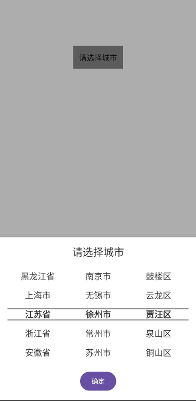

v2.3.0开始可用
# 基于JetpackCompose的省市县级联选择器
（应该是全网唯一）
## 环境

* **环境**:
    - material3:1.0.0
    - compose:1.2.0
    - kotlinx-serialization-json:1.3.2

## 实现思路

1.从 JSON 文件中加载和解析数据，提供省、市、区数据。

2.利用状态管理和LazyListState实现三级联动

3.使用JetpackCompose等处理交互逻辑

## 使用方式
### setting.gradle
```Kotlin
dependencyResolutionManagement {
    repositoriesMode.set(RepositoriesMode.FAIL_ON_PROJECT_REPOS)
    repositories {
        google()
        mavenCentral()
        maven { url 'https://jitpack.io' }
    }
}
```
### build.gradle(:app)
```Kotlin
    implementation 'com.github.simonniex:SimonCityPicker:2.2.0'
```
### YourActivity
```Kotlin
SimonCityPicker(
    context = context,
    isCity = isCity,
    onCitySelected = { city ->
        selectedCity=city
        isCity = false
    }
)
```
## 案例

```kotlin
val context = LocalContext.current
var selectedCity by remember { mutableStateOf("请选择城市") }
var isCity by remember { mutableStateOf(false) }
Row(
    horizontalArrangement = Arrangement.Center,
    modifier = Modifier.fillMaxWidth().padding(100.dp)
) {
    TextButton(modifier = Modifier.background(Color.Gray),onClick = {
        isCity = true
    }){
        Text(selectedCity)
    }
}
SimonCityPicker(
    context = context,
    isCity = isCity,
    onCitySelected = { city ->
        selectedCity=city
        isCity = false
    }
)
```

## 效果展示


